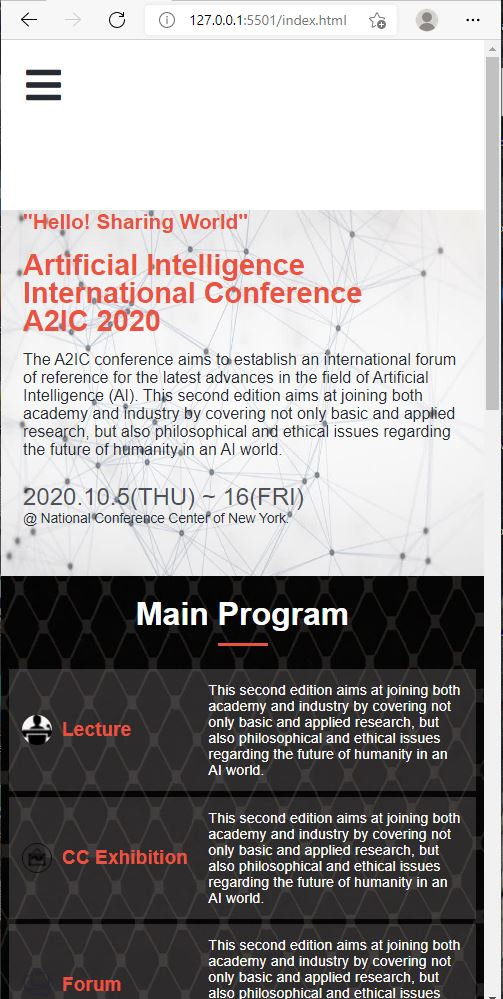
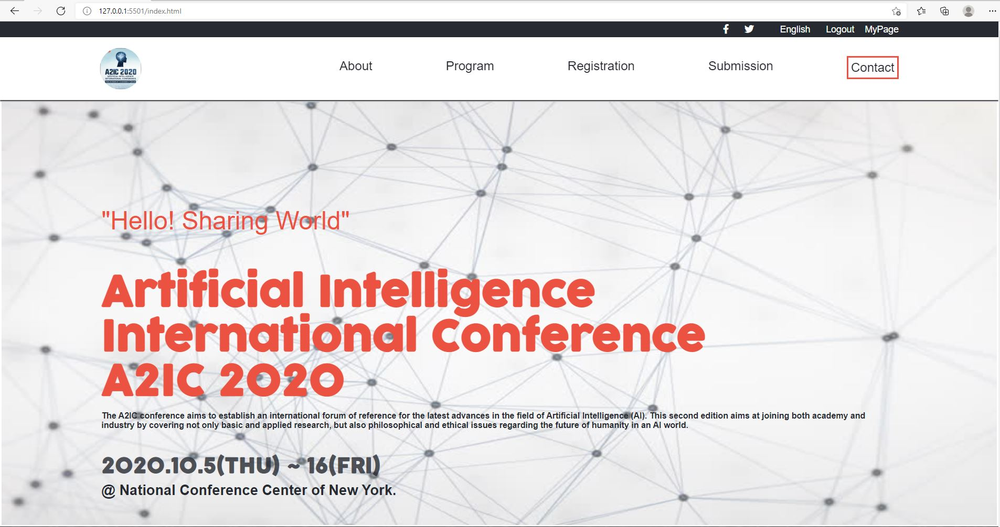

# First-Capstone-Project

> This project is to create a mobile and desktop version of an  online conference website.

This is a capstone project to showcase the skills acquired the last 4 weeks studying HTML, CSS and DOM. The project is online conference website.

## Live Demo

[Live Demo Link](https://kossi-stack.github.io/First-Capstone-Project/)

[Watch a video here](https://www.loom.com/share/21e93a7e71f747dd86d1f2efbae818a3)

## Built With

- Html
- Css
- Javascript

##  Prerequisites

- Text editor
- Git
- Html
- Css

## Getting Started

To get a local copy up and running follow these simple example steps.

- You can clone this repo by typing git clone `https://github.com/Kossi-stack/First-Capstone-Project.git` on your terminal

- Type cd `First-Capstone-Project` to access the project on the terminal

Run `npm install` from the command line

Run `npx hint .` to test for html linting check

Run `npx stylelint "**/*.{css,scss}"` to test for css linting check 

Run `npx eslint .` to test for js linting check

## Author

👤 **Kossi-Stack**

- GitHub: [@githubhandle](https://github.com/Kossi-stack/First-Capstone-Project)
- LinkedIn: [LinkedIn](https://www.linkedin.com/in/kossifioklou2406/)

## 🤝 Contributing

Contributions, issues, and feature requests are welcome!

Feel free to check the [issues page](https://github.com/Kossi-stack/First-Capstone-Project/issues).

## Show your support

Give a ⭐️ if you like this project!

## Acknowledgments

- A spcial thanks to  "Creative Commons license of the design" for providing this design template used for this project.
- A special thanks to Microverse for inspiring this project. 
- Once again a big thanks to the Microverse Team for the incredible work.

## 📝 License

This project is [MIT](./MIT.md) licensed.
